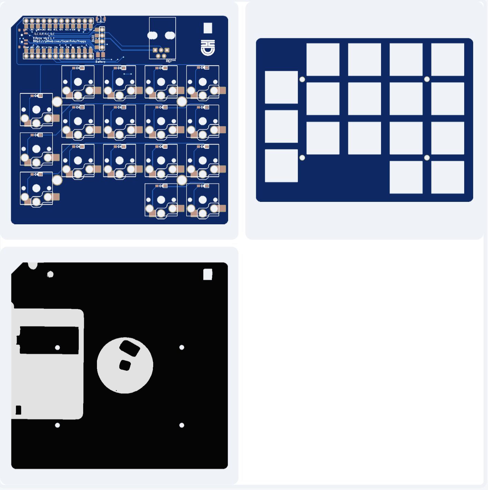

# Floppy keyboard

A 90x94mm hotswap 34 keys split choc v1 keyboard, in the footprint of a floppy disk.

## Ordering

Gerbers to upload are under `gerbers/`.

Recommandations:
- top plate: 1.2mm
- back plate: 1.6mm
- pcb: 1.6mm

> ![NOTE]
> Remember to remove the order number on the top plate and back plate. On the PCB, there is a text that need to be used for the order number: "JLCJLCJLCJLC".

## Components for one keyboard

- 2 pro-micro compatible MCU (eg Liatris, Nice!Nano)
- 34 hotswap kailh choc v1 socket (PG1350)
- 34 choc v1 switches & keycaps
- 34 SMD diodes
- 2 RJ11 4P4C connectors (18mm x 11mm)
- 1 RJ11 4P4C cable that **needs to be straight** (when put side to side, the cables inside should match), otherwise **you will end up swapping VCC and GND, and putting the data pin to GND on the other half**

